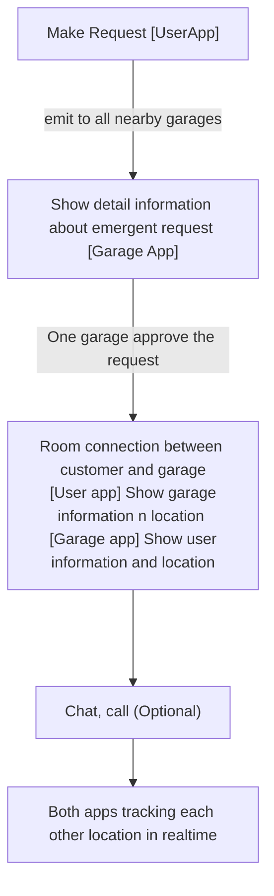

```mermaid
  flowchart TB
	makeRequest["Make Request [UserApp]"]
	garageShowRequest["Show detail information about emergent request [Garage App]"]
	roomConnection["Room connection between customer and garage\n [User app] Show garage information n location \n [Garage app] Show user information and location"]
	  roomChatting["Chat, call (Optional)"]
	  tracking["Both apps tracking each other location in realtime"]
  makeRequest -- emit to all nearby garages ---> garageShowRequest -- One garage approve the request --->roomConnection ---> roomChatting --> tracking
```
